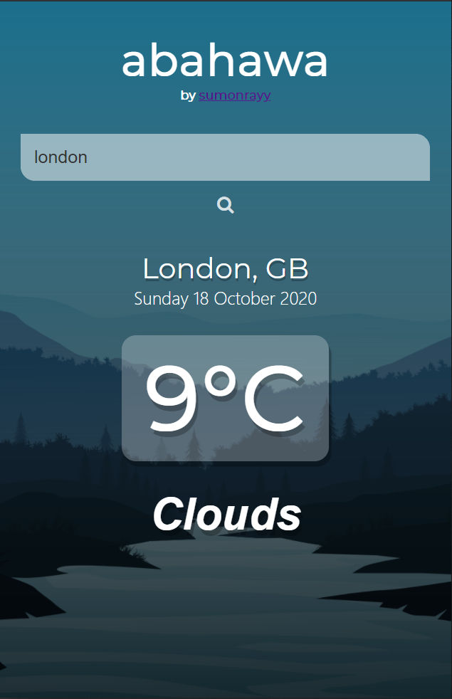

# vue-weather-app 🌞🌤⛈

<p> A Minimalistic Weather Application Made with Vuejs & NodeJs . </p>

> NOTE: To use this app locally or in a server be sure to create an account on [OpenWeatherMap.org](https://openweathermap.org/) and create a new personal key to use in this app.



## features

- 🌍 Current weather based on geolocalization
- 🗼 Add city manually
- 💮 Minimalistic Design
- 🌡 Background Image Transition Animation Based on Temperature

## Project setup

```
npm install
```

### Compiles and hot-reloads for development

```
npm run serve
```

### Compiles and minifies for production

```
npm run build
```

### Lints and fixes files

```
npm run lint
```

### Customize configuration

See [Configuration Reference](https://cli.vuejs.org/config/).

## contributing

You can contribute to improve this project by:

- edit the code
- creating a pull request
- submitting new ideas / features suggestions
- reporting a bug
